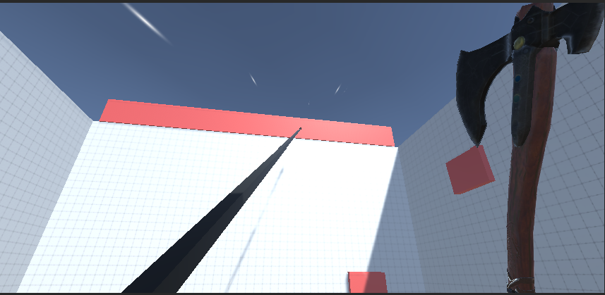
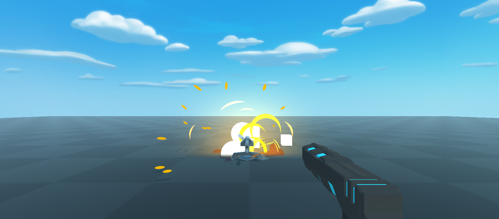
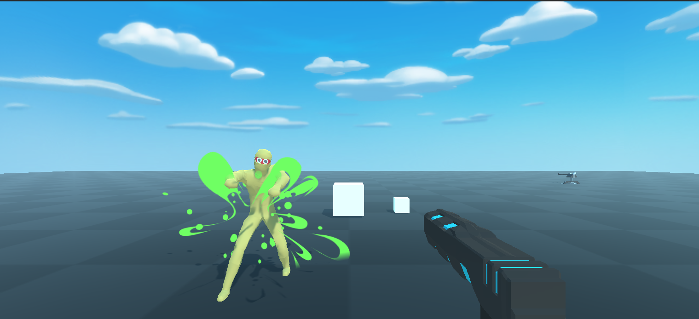

# CrazyFps

Some Snaps

Level Design using the unity's Terrain system. Later on populated by Grass and Tree Assets

-------------------------------------------------------------------------------------------------------------

The Axe throw and return on command. Axe Throw inspired by the God of War game. 

-------------------------------------------------------------------------------------------------------------

Training dummy with death and revive partical for gun testing.

-------------------------------------------------------------------------------------------------------------

Hookshot that attatches to specific layer on an object. With speed particles and no Jitter

-------------------------------------------------------------------------------------------------------------

Customizable turret with customizable attribute and bullets. Particles on damage and death

-------------------------------------------------------------------------------------------------------------

Virus shooting Zombie enemy with Basic A.I for patrol, follow and attack based on range. Also, particles. YAY!
